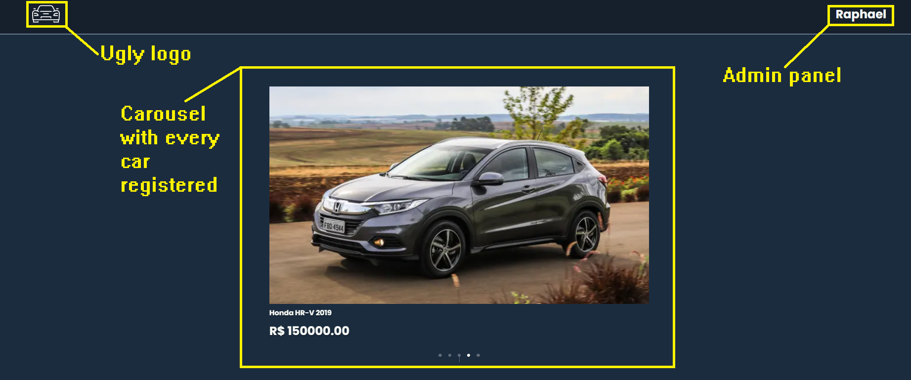
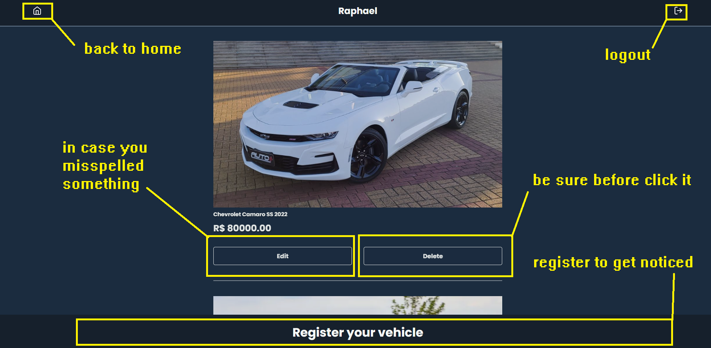

## Getting Started

Click [here](https://cartalogue-webpage.vercel.app/) to access the webpage

<br>

OR

<br>

Run the development server:

```bash
npm run dev
# or
yarn dev
```

Open [http://localhost:3000](http://localhost:3000) with your browser to see the result.

<br>

## Technologies:

<br>

<ul>Next.js</ul>
<ul>ReactJs</ul>
<ul>Sass</ul>
<ul>Axios</ul>

<br>

## Welcome to CarTalogue.

<br>

Here you can check many vehicles from users that want to sell.



<br>
<br>

After you login in the webpage you can register your vehicle to sell, edit or delete in the admin panel, just by clicking in your name.



<br>
<br>

Any questions about this project? Send a mail to [raphaeldorfman@gmail.com](mailto:raphaeldorfman@gmail.com)
